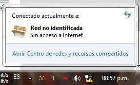

# SIGNIFICADO DE FALLAS EN ANTENAS

## (Windows) - RED NO IDENTIFICADA

`NO RECONOCE` la antena:

1. probar ingresando a <b> _Redes e Internet > Configuración del Adaptador > IPv4_ </b> y colocar la IP en `MANUAL`
2. Si persiste el error `REEMPLAZAR EL POE`
3. Si persiste el error, `descartar la antena`

##

## NanoLoco M5

Significa que el nanoloco `ESTÁ MUERTO` no sirve, se debe descartar.

##

## Mikrotik - IPv4 en 0.0.0.0

La <b><i>IPv4</i></b> fue modificada, y hubo un error de DHCP, por lo que NO SE PUEDE INGRESAR DESDE EL NAVEGADOR, se debe ingresar desde <b>WINBOX</b>

## Ubiquiti - USUARIO Y CONTRASEÑA OLVIDADOS

En caso de olvidarse el usuario y contraseña, podemos recurrir al <b>BOTÓN DE RESETEO</b> ubicado debajo de las antenas

*NANOLOCO M5*

*NANO AC*

*NANOBEAM M5*

*LITEBEAM*

*POWERBEAM*

