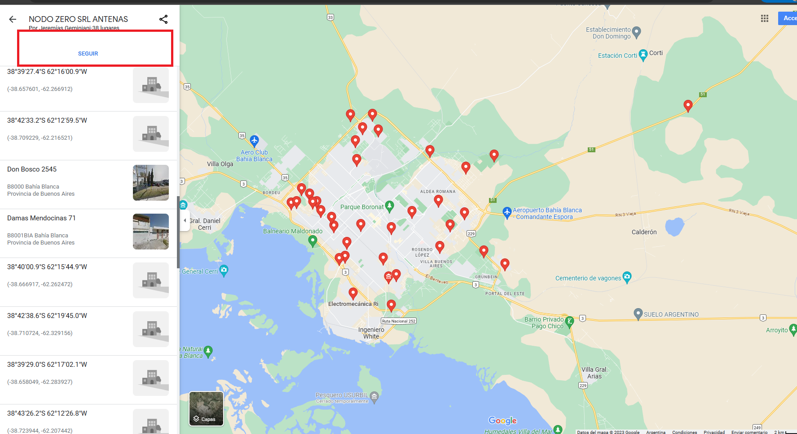

# COMO ACCEDER A LOS MAPAS DE ANTENAS

## Entrar al enlace

https://goo.gl/maps/WEreZXgZBsax2ntj6

Una vez se haya entrado al `ENLACE DE GOOGLE MAPS`, se tiene que dar en el botón `SEGUIR` para así tenerlos en el mapa de la PC o Teléfono

Los mapas están enúmerados por `NÚMERO`, `NOMBRE` y `DIRECCIÓN`
Sino se puede consultar en el archivo llamado `MAPAS UBICACIÓN.TXT`
Allí se obtienen los datos adicionales

## Significado
`UB - UBIQUITI` : Solo soporta antenas *UBIQUITI*
`MK - MIKROTIK` : Solo soporta antenas *MIKROTIK*
`UB/MK - UBIQUIT/MIKROTIK`: Soporta tanto *MIKROTIK* como *UBIQUITI*
