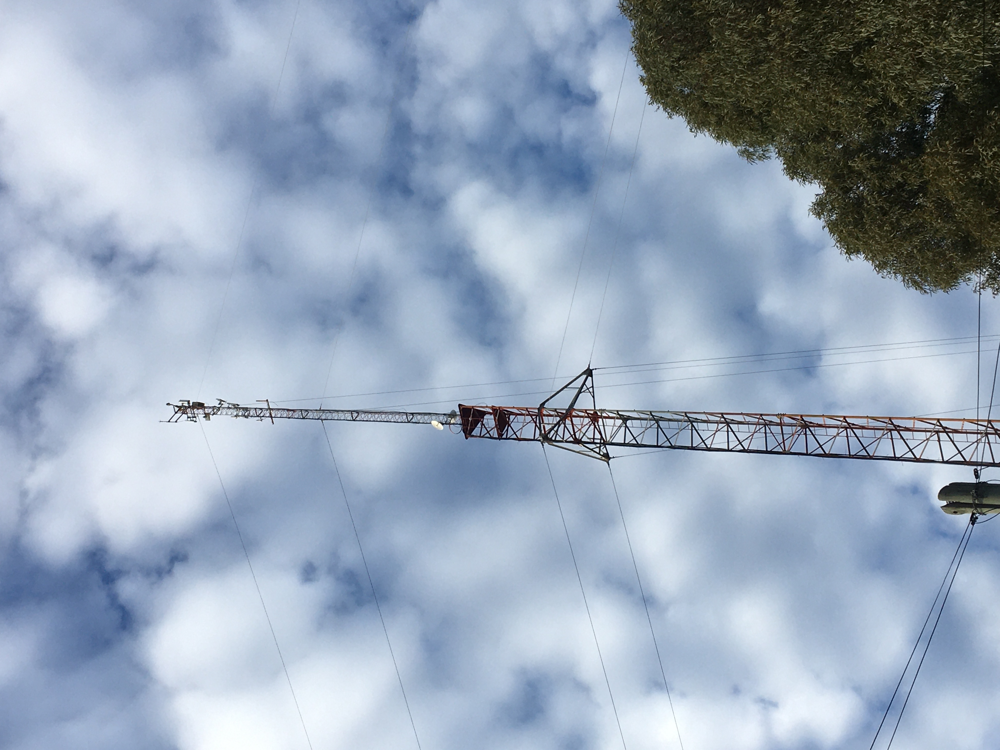
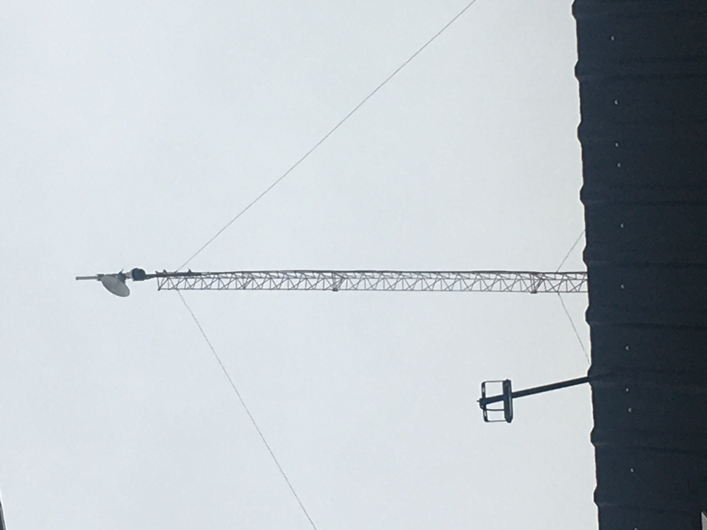
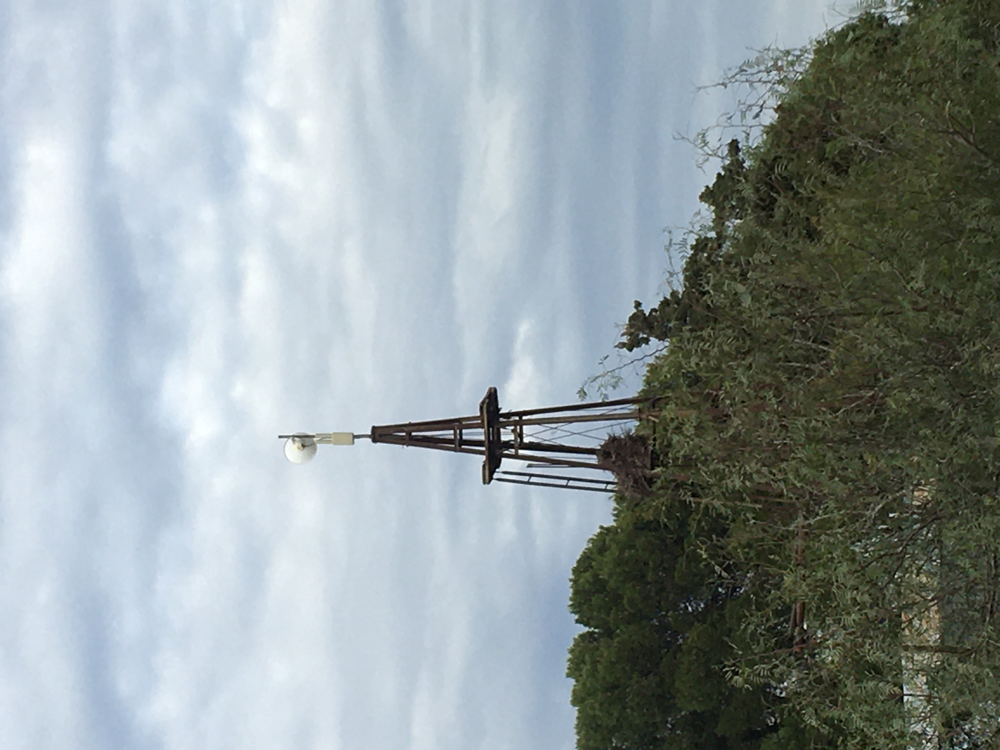

# NODOS PRINCIPALES (IMAGENES)

## Nodo 2 (SAN CARLOS) - [UBIQUITI]

Rigamonti y Mariano Reynald

  

## Nodo 27 (HERNANDEZ) - [UBIQUITI]

José Hernandez 1141

  

## Nodo CAMPO HERRERA (MIKROTIK)

Cerca del campo `La Alianza`

  

